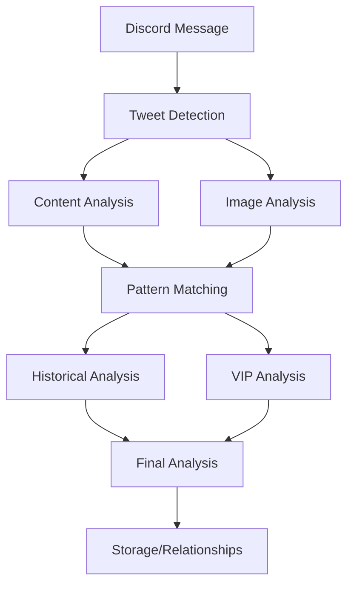

# Crypto Brain - Component Documentation

## Core Services

### DiscordMonitor
**Purpose**: Monitors Discord channel for new tweet messages by connecting to an existing Chrome instance.

**Key Features**:
- Real-time message monitoring using Puppeteer
- Connects to existing Chrome browser session
- Tweet URL extraction and validation
- Message deduplication
- Engagement metrics collection
- Automatic reconnection handling
- Error recovery and status monitoring

**Usage Example**:
```typescript
const monitor = new DiscordMonitor();
await monitor.connectToExistingBrowser(9222); // Connect to Chrome on port 9222
```

### HybridPatternMatcher
**Purpose**: Analyzes tweets for memecoin patterns using both quick filters and LLM analysis.

**Key Features**:
- Quick pattern matching for common cases
- LLM-based analysis for complex scenarios
- Configurable confidence scoring
- Pattern categorization
- Error handling and retry logic

**Patterns Detected**:
- Animal incidents/rescue stories
- Exchange listings
- VIP mentions
- Viral memes and cultural references

### TokenMetricsService
**Purpose**: Fetches and tracks token price/volume metrics from multiple sources.

**Key Features**:
- DexScreener integration for established tokens
- PumpFun IDL support for new tokens
- Price impact calculation
- Market momentum scoring
- Caching system for performance
- Fallback data sources

### ImageAnalyzer
**Purpose**: Analyzes images in tweets using GPT-4V for additional context.

**Key Features**:
- Integration with GPT-4V
- Image context analysis
- Memecoin relevance detection
- Caching for duplicate images
- Error handling and fallback strategies

### MemecoinAnalyzer
**Purpose**: Main orchestration service that combines all analyses to detect memecoin opportunities.

**Key Features**:
- Pattern detection coordination
- VIP analysis integration
- Historical context tracking
- Confidence scoring
- Result storage and relationship mapping

## Data Flow



## Database Architecture

### MongoDB Collections
- `tweets`: Stores analyzed tweets and results
- `vipAccounts`: Tracks influential accounts
- `patterns`: Historical pattern performance

### Neo4j Graph Structure
- Nodes:
  - `Tweet`: Tweet information
  - `Memecoin`: Detected coins
  - `Event`: Pattern occurrences
  - `Account`: Tweet authors
- Relationships:
  - `POSTED`: Account -> Tweet
  - `INFLUENCED`: Tweet -> Memecoin
  - `RELATED_TO`: Event connections

## Integration Points

### External APIs
- OpenAI GPT-4 & GPT-4V
- DexScreener
- PumpFun IDL (stub)

### Browser Integration
- Chrome DevTools Protocol
- Puppeteer connection management
- Discord web interface interaction

## Error Handling

### Discord Monitoring
- Connection loss recovery
- Authentication verification
- Rate limit handling
- Page error management

### Analysis Pipeline
- LLM timeout handling
- Image analysis fallbacks
- Price data unavailability
- Database connection issues

## Monitoring

### Health Metrics
- Connection status
- Message processing rate
- Analysis success rate
- Error frequency
- Processing latency

### Performance Monitoring
- API call latencies
- Processing times
- Cache hit rates
- Error rates by component

## Configuration Options

### Discord Monitor
```typescript
interface MonitorConfig {
    debugPort: number;         // Chrome debugging port
    pollInterval: number;      // Message check interval
    maxReconnectAttempts: number;
    reconnectDelay: number;
}
```

### Pattern Matcher
```typescript
interface PatternConfig {
    confidence: {
        high: number;
        medium: number;
        minimum: number;
    };
    engagement: {
        likes: number;
        retweets: number;
    };
}
```

## Testing Approach

### Unit Tests
- Pattern matching validation
- Price impact calculations
- VIP detection logic

### Integration Tests
- Discord message processing
- Full analysis pipeline
- Database operations

### Mock Data
- Sample tweets
- Price data
- VIP interactions

## Resource Management

### Caching Strategy
- Image analysis results
- Price data
- Pattern analysis results
- VIP account information

### Cleanup Procedures
- Browser connection handling
- Database connection management
- Temporary data cleanup
- Resource deallocation
